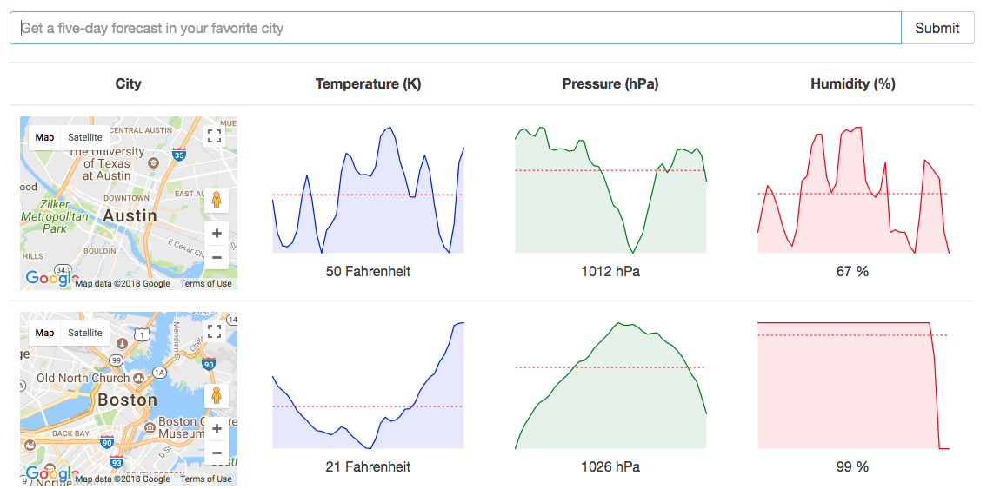

# ReduxSimpleStarter

Got the ReduxSimpleStarter from Stephen Grider's github


#### Instructions:

```
> git clone https://github.com/MeenaKamran/Weather.git
> cd Weather
> npm install
> npm start
```

  * Go to http://localhost:8080/
  * Enter the city you want to see the weather.
  * Every time you enter a city it adds to the list.

  

## Built With
React-Redux
